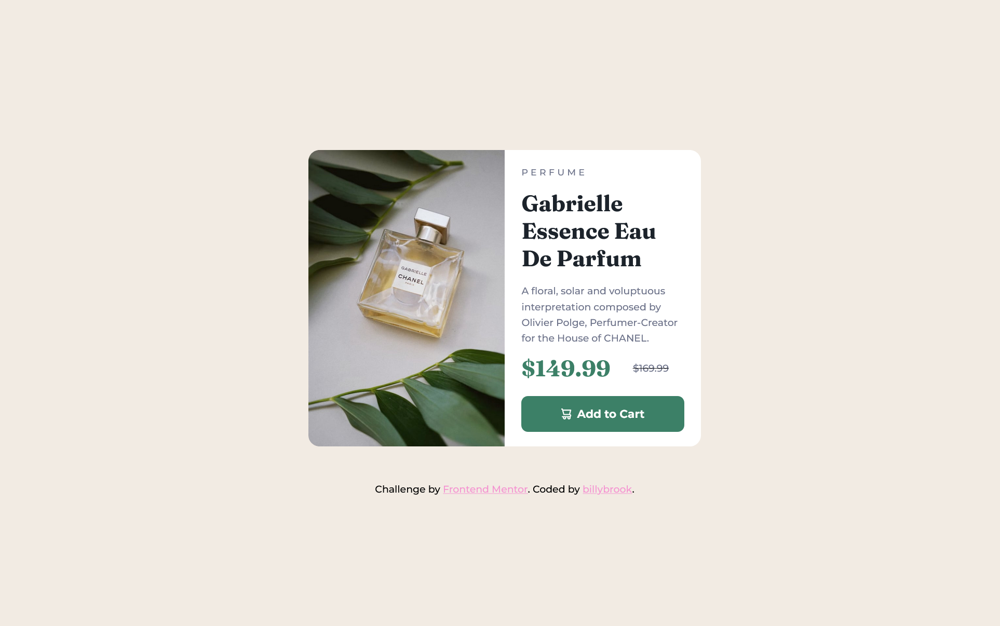
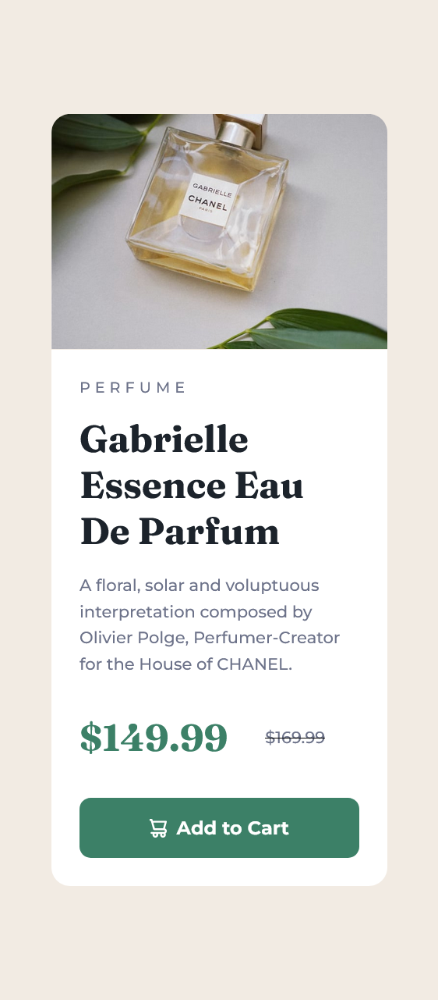

# Frontend Mentor - Product preview card component solution

This is a solution to the Product preview card component challenge on Frontend Mentor (https://www.frontendmentor.io/challenges/product-preview-card-component-GO7UmttRfa). 

## Table of contents

- [Overview](#overview)
  - [The challenge](#the-challenge)
  - [Screenshots](#screenshots)
  - [Links](#links)
- [My process](#my-process)
  - [Built with](#built-with)
  - [What I learned](#what-i-learned)
  - [Continued development](#continued-development)
  - [Useful resources](#useful-resources)
- [Author](#author)
- [Acknowledgments](#acknowledgments)

**Note: Delete this note and update the table of contents based on what sections you keep.**

## Overview

### The challenge

Users should be able to:

- View the optimal layout depending on their device's screen size
- See hover and focus states for interactive elements

The design and specifications of the challange were as follows:

- <a href="https://github.com/billybrook/Product-Preview-Project/blob/main/design/mobile-design.jpg" target="_blank">Mobile Design</a>
- <a href="https://github.com/billybrook/Product-Preview-Project/blob/main/design/desktop-design.jpg" target="_blank">Desktop Design</a>
- <a href="https://github.com/billybrook/Product-Preview-Project/blob/main/design/active-states.jpg" target="_blank">Hover State Of Button</a> 
- <a href="https://github.com/billybrook/Product-Preview-Project/blob/main/design/style-guide.md" target="_blank">Style Guide Specifications</a>

### Screenshots


A screenshot of the desktop display of the page for a screen width of 1440 pixels as per the design requirements.
<br />
<br />
<br />
<br />

A screenshot of the mobile display of the page for a screen width of 375 pixels as per the design requirements.


### Links

- Solution URL: [Add solution URL here](https://your-solution-url.com)
- Live Site URL: [Add live site URL here](https://your-live-site-url.com)

## My process

### Built with

- HTML5 
- CSS 

### What I learned

This is the first project I have attempted to code. I have leaned heavely on <a href="https://www.youtube.com/watch?v=BMOH4zSLTnQ">Thomas Sankara's Youtube tutorial video</a> to code this project.

To see how you can add code snippets, see below:

```html
<h1>Some HTML code I'm proud of</h1>
```
```css
.proud-of-this-css {
  color: papayawhip;
}
```
```js
const proudOfThisFunc = () => {
  console.log('🎉')
}
```

If you want more help with writing markdown, we'd recommend checking out [The Markdown Guide](https://www.markdownguide.org/) to learn more.

**Note: Delete this note and the content within this section and replace with your own learnings.**

### Continued development

Use this section to outline areas that you want to continue focusing on in future projects. These could be concepts you're still not completely comfortable with or techniques you found useful that you want to refine and perfect.

**Note: Delete this note and the content within this section and replace with your own plans for continued development.**

### Useful resources

- [Example resource 1](https://www.example.com) - This helped me for XYZ reason. I really liked this pattern and will use it going forward.
- [Example resource 2](https://www.example.com) - This is an amazing article which helped me finally understand XYZ. I'd recommend it to anyone still learning this concept.

**Note: Delete this note and replace the list above with resources that helped you during the challenge. These could come in handy for anyone viewing your solution or for yourself when you look back on this project in the future.**

## Author

- Website - [Add your name here](https://www.your-site.com)
- Frontend Mentor - [@yourusername](https://www.frontendmentor.io/profile/yourusername)
- Twitter - [@yourusername](https://www.twitter.com/yourusername)

**Note: Delete this note and add/remove/edit lines above based on what links you'd like to share.**

## Acknowledgments

This is where you can give a hat tip to anyone who helped you out on this project. Perhaps you worked in a team or got some inspiration from someone else's solution. This is the perfect place to give them some credit.

**Note: Delete this note and edit this section's content as necessary. If you completed this challenge by yourself, feel free to delete this section entirely.**
